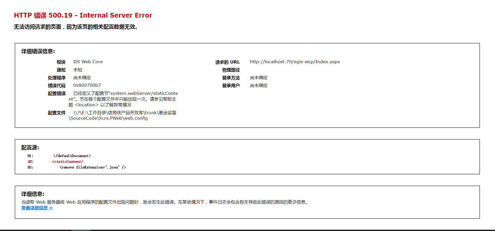
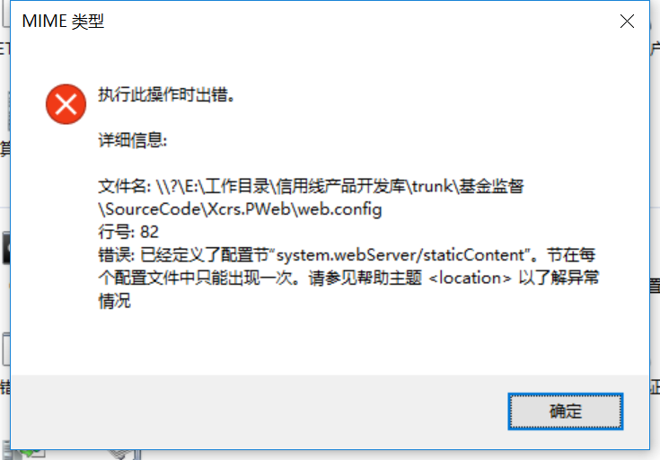

## IIS MIME类型

项目一直跑不起来，提示500.19的错误



后根据 错误信息中提到的配置文件，在webConfig中找到了对应的节点“staticContent”

```
<staticContent>
			<mimeMap fileExtension=".json" mimeType="text/json" />
</staticContent>
```

注释掉这个节点的配置后，发现项目可以跑起来了，但是为什么呢？

原来这个是因为在IIS7及以前的版本中默认是不支持json类型的，然后同事就在配置文件中加了一个类型

但是我本地的环境是IIS10，默认是支持JSON类型的，所以在IIS读取配置文件的时候就报错了

IIS->选择网站->双击MIME类型->报错




以前用高级版本的IIS，都没碰到这样的问题，做个笔记