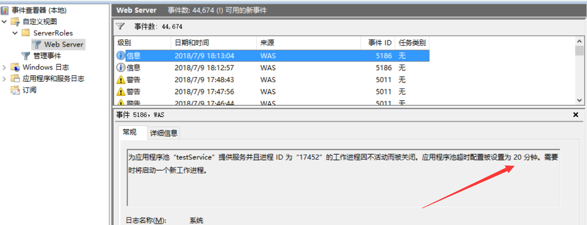
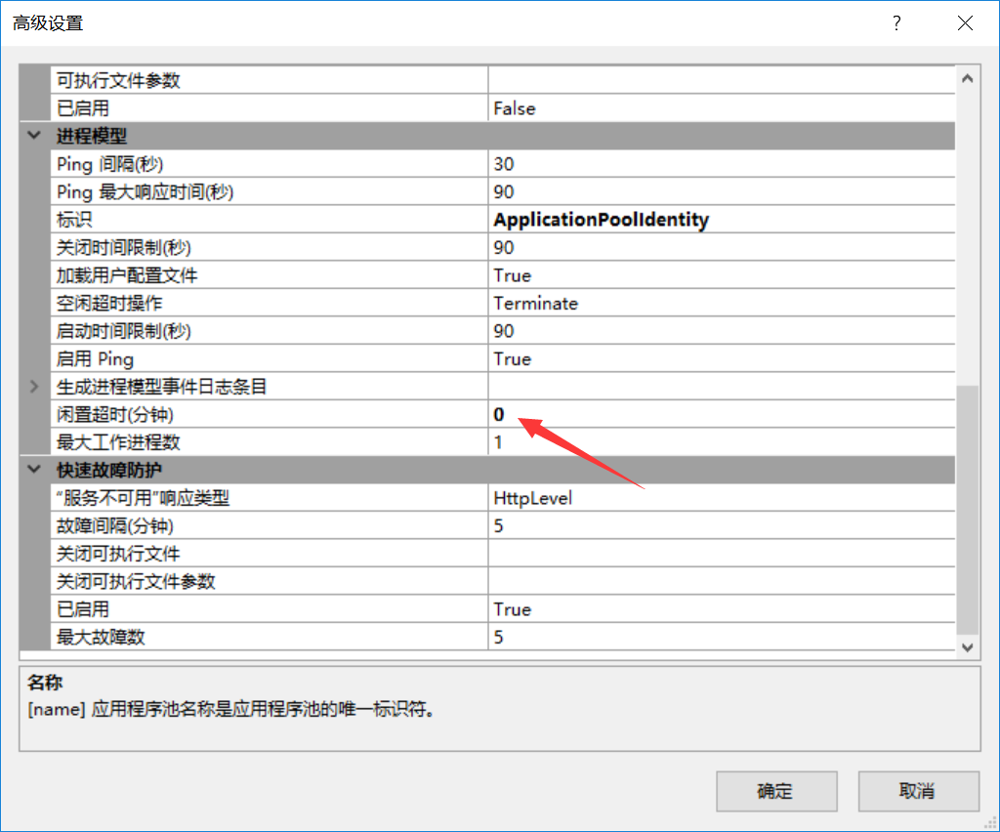

这两天被IIS搞死

做了一个服务端(webservice)，请求登录后会有一个循环一直来执行某个工作，但是每次20分钟后这个一直在跑的任务却停止了。20分钟，这个数字很熟悉，跟session过期时间一样，所以就去改了session的时间，但是还是没有效果。尝试过很多方法后依旧不行，最后查看了下 “事件查看器”

从这个信息可以得知，这个线程是被IIS给杀死了，然后查了下，原来IIS在 应用程序里面还有个“闲置超时”的参数

IIS=>应用程序池=>对应的网站=>高级=>进程模型=>闲置超时(分钟)=>设置为0

然后问题就解决了