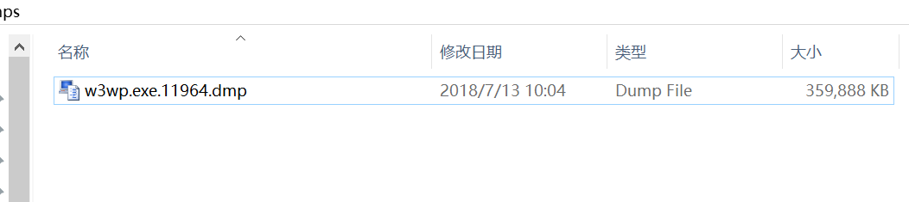
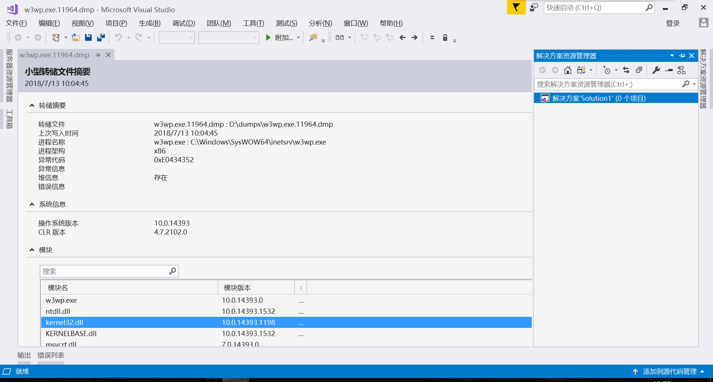

因为调用c++做的dll，出现了一种偶发性的报错，并且这个错误信息c#是捕获不到的，一旦发生iis就跪了

后来知道有dmp文件调试这种技术。接下来就大概讲讲这个玩意怎么玩


1.启用Windows Error Reporting Service 服务，最好设置为自动

2.如果安装了vs，需要删除注册表中，默认的调试工具

```
找到注册表删除以下2个项目
HKEY_LOCAL_MACHINE\SOFTWARE\Microsoft\Windows NT\CurrentVersion\AeDebug\Debugger

HKEY_LOCAL_MACHINE\SOFTWARE\Microsoft\.NETFramework\DbgManagedDebugger

在 64 位 操作系统上也删除以下注册表项：

HKEY_LOCAL_MACHINE\SOFTWARE\Wow6432Node\Microsoft\Windows NT\CurrentVersion\AeDebug\Debugger

HKEY_LOCAL_MACHINE\SOFTWARE\Wow6432Node\Microsoft\.NETFramework\DbgManagedDebugger

```

3.设置dmp文件保存路径

复制该文本到txt,保存为所有文本，修改文件名为reg，然后执行即可

```
Windows Registry Editor Version 5.00
[HKEY_LOCAL_MACHINE\SOFTWARE\Microsoft\Windows\Windows Error Reporting\LocalDumps\w3wp.exe]
"DumpFolder"=hex(2):64,00,3a,00,5c,00,64,00,75,00,6d,00,70,00,73,00,00,00
"DumpCount"=dword:00000002
"DumpType"=dword:00000002
```

其中DumpFolder 对应的value值是 16进制的文件路径 ，其实就是D:\dumps


4.iis崩溃后 就会生成一个dmp文件




直接双击它，vs会打开这个文件




解决方案=>右键属性=>调试源码=>添加源码路径。 一定要是解决方案的路径啊，而不是项目的路径


然后设置符号:


也可以通过:工具=>选项=>调试=>符号  选勾选


然后 点击 “混合进行调试”，错误的地方马上就自动出来了。

第一次加载“符号”会很长时间